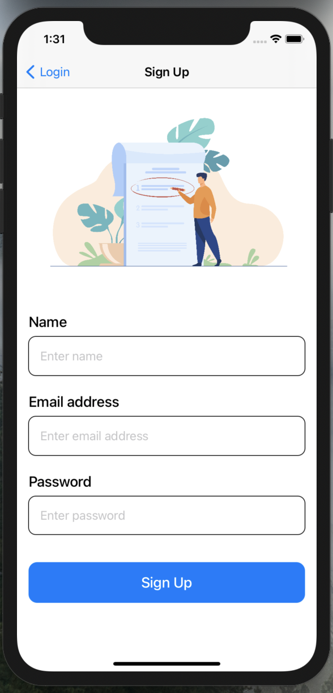

# ToDo
A ToDo application which uses Firebase Authentication for user authenctication and Firebase Realtime Database for synchornization across multiple devices

Onboarding Screen |        Login View     
:-------------------------:|:-------------------------:|
|

SignUp View |        Home View
:-------------------------:|:-------------------------:|
|

Notification   
:-------------------------:
 

<b>Login Display Image credits <a href="http://www.freepik.com">Designed by pch.vector / Freepik</a> <b> 
